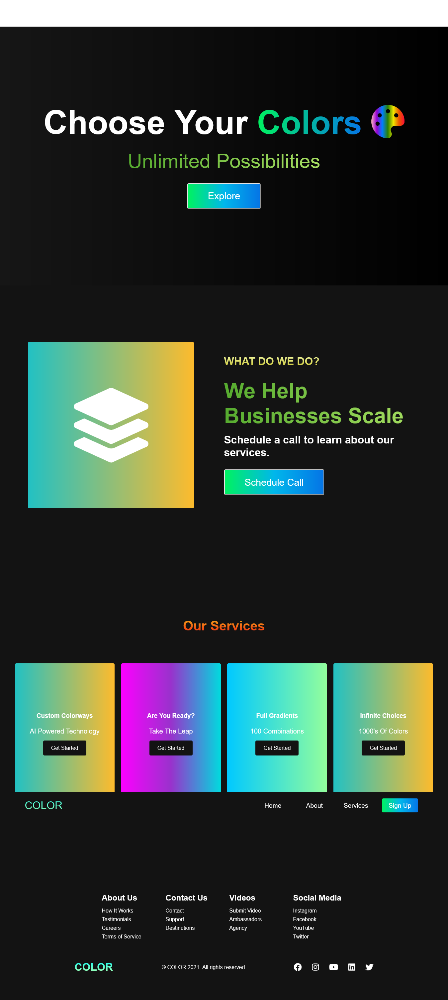
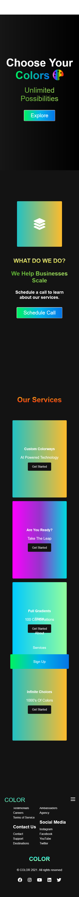

<h1>Color Gradients :art:</h1>

<h2>A color gradient website using flexbox, grid, and some positioning elements.</h2>

This website is responsive using flexbox, grid, and some positioning elements. I followed along with a tutorial that is beginner friendly. I changed all the colors from the original tutorial, added a logo that changes color when you hover over it, added a hover effect to change color to all the buttons, footer links and social icons. I've also added JavaScript function to the copyright date so that it updates automatically every year.

### Link

- Live Site: [Color Gradients](https://leslielopez25.github.io/Responsive-Website/)

### Screenshots

 

